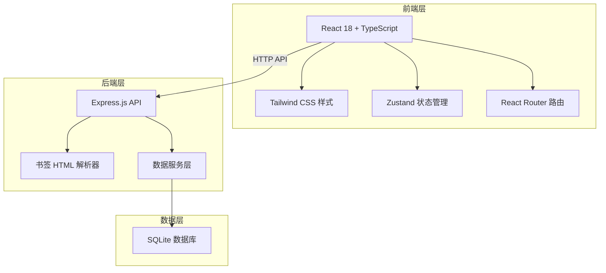
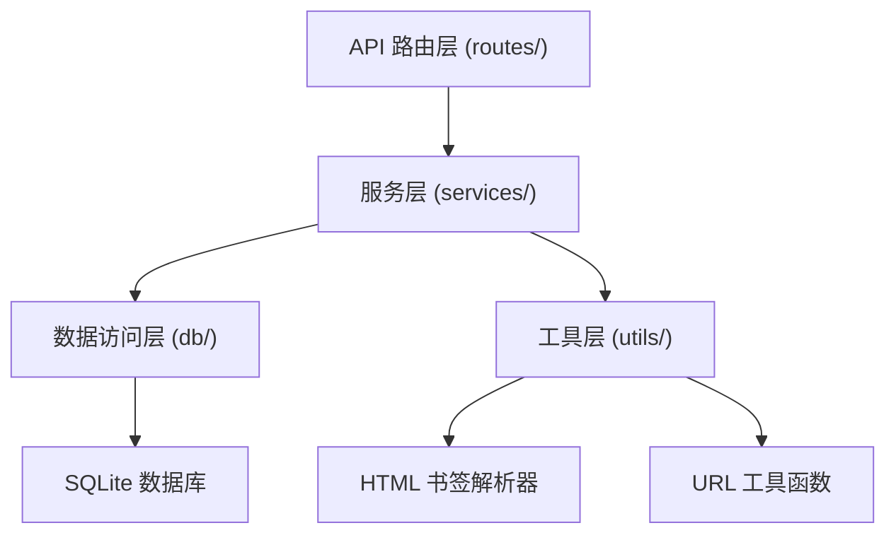
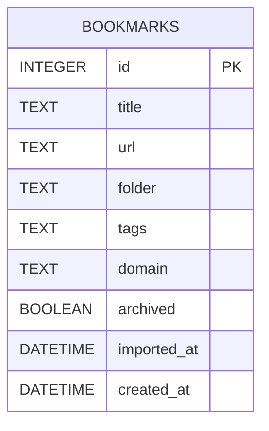

## 1. 架构设计



## 2. 技术描述

- **前端**：React@18 + TypeScript + Tailwind CSS@3 + Vite + Zustand + React Router
- **初始化工具**：vite-init (react-express-ts 模板)
- **后端**：Express@4 + TypeScript + better-sqlite3
- **数据库**：SQLite (本地文件存储)
- **解析器**：cheerio (HTML 书签文件解析)
- **图标库**：lucide-react

## 3. 路由定义

| 前端路由 | 用途 |
|-------|---------|
| / | 仪表板页面 |
| /bookmarks | 书签管理页面 |

| API 路由 | 方法 | 用途 |
|-------|------|---------|
| /api/bookmarks | GET | 获取书签列表（支持搜索、筛选） |
| /api/bookmarks/:id | PUT | 更新书签状态（归档等） |
| /api/bookmarks/:id | DELETE | 删除单个书签 |
| /api/bookmarks/batch | PUT | 批量更新书签（归档） |
| /api/bookmarks/batch | DELETE | 批量删除书签 |
| /api/import | POST | 导入 HTML 书签文件 |
| /api/stats/overview | GET | 获取统计概览数据 |
| /api/stats/duplicates | GET | 获取重复链接列表 |
| /api/stats/domains | GET | 获取域名分组统计 |
| /api/stats/recent | GET | 获取最近导入记录 |

## 4. API 定义

```typescript
interface Bookmark {
  id: number;
  title: string;
  url: string;
  folder: string;
  tags: string[];
  domain: string;
  archived: boolean;
  importedAt: string;
  createdAt: string;
}

interface BookmarkInput {
  title: string;
  url: string;
  folder?: string;
  tags?: string[];
}

interface StatsOverview {
  totalCount: number;
  duplicateCount: number;
  domainCount: number;
  archivedCount: number;
}

interface DuplicateEntry {
  url: string;
  count: number;
  bookmarks: Bookmark[];
}

interface DomainStat {
  domain: string;
  count: number;
}

interface ImportResult {
  success: number;
  skipped: number;
  duplicates: number;
  bookmarks: Bookmark[];
}
```

## 5. 服务器架构图



## 6. 数据模型

### 6.1 数据模型定义



### 6.2 数据定义语言

```sql
CREATE TABLE IF NOT EXISTS bookmarks (
  id INTEGER PRIMARY KEY AUTOINCREMENT,
  title TEXT NOT NULL,
  url TEXT NOT NULL,
  folder TEXT DEFAULT '',
  tags TEXT DEFAULT '[]',
  domain TEXT NOT NULL,
  archived BOOLEAN DEFAULT 0,
  imported_at DATETIME DEFAULT CURRENT_TIMESTAMP,
  created_at DATETIME DEFAULT CURRENT_TIMESTAMP
);

CREATE INDEX IF NOT EXISTS idx_bookmarks_url ON bookmarks(url);
CREATE INDEX IF NOT EXISTS idx_bookmarks_domain ON bookmarks(domain);
CREATE INDEX IF NOT EXISTS idx_bookmarks_archived ON bookmarks(archived);
CREATE INDEX IF NOT EXISTS idx_bookmarks_imported_at ON bookmarks(imported_at);
```
