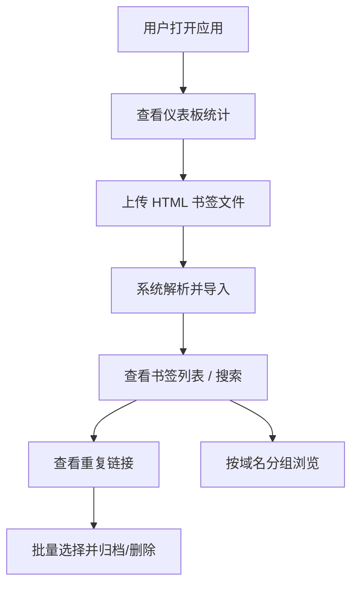

## 1. 产品概述

本地书签收藏与重复链接清理器，帮助用户管理浏览器书签，支持批量导入、智能去重和高效检索。
- 解决书签杂乱、重复链接堆积、难以查找的痛点，服务于需要高效管理大量书签的用户
- 提供直观的可视化统计和一键清理能力，让书签管理变得简单高效

## 2. 核心功能

### 2.1 功能模块
1. **仪表板页面**：统计概览、重复链接列表、域名分布统计、最近导入记录
2. **书签管理页面**：书签列表、搜索过滤、按域名分组、批量操作
3. **导入功能**：HTML 书签文件上传、自动解析标题/URL/文件夹/标签

### 2.2 页面详情
| 页面名称 | 模块名称 | 功能描述 |
|-----------|-------------|---------------------|
| 仪表板 | 统计概览卡片 | 展示书签总数、重复链接数、域名数、已归档数 |
| 仪表板 | 重复链接列表 | 列出所有重复 URL，支持选择后批量删除或归档 |
| 仪表板 | 域名统计 | 按域名分组展示书签数量，支持排序 |
| 仪表板 | 最近导入记录 | 展示最近 10 条导入的书签 |
| 书签管理 | 搜索栏 | 按标题、URL、标签进行关键词搜索 |
| 书签管理 | 书签列表 | 展示所有书签，支持按文件夹/域名筛选 |
| 书签管理 | 批量操作 | 多选书签后进行批量归档或删除 |
| 导入弹窗 | 文件上传 | 支持拖拽或点击上传浏览器导出的 HTML 书签文件 |
| 导入弹窗 | 解析预览 | 展示即将导入的书签数量和内容预览 |

## 3. 核心流程

用户打开应用后，可以在仪表板查看统计概览。上传浏览器导出的 HTML 书签文件，系统自动解析并存储。用户可通过搜索功能快速查找书签，查看重复链接列表并批量处理。书签可按域名分组浏览，选中的书签可标记为归档状态。

## 4. 用户界面设计

### 4.1 设计风格
- **主色调**：深蓝色 (#1e3a5f) 作为主色，搭配琥珀橙 (#f59e0b) 作为强调色，中性灰 (#64748b) 作为辅助色
- **按钮风格**：圆角 8px，带微妙阴影，hover 状态有颜色加深和轻微上浮
- **字体**：标题使用系统衬线字体 (Georgia) 增加质感，正文使用 Inter
- **布局风格**：卡片式布局，顶部导航，内容区域采用 Grid 网格
- **图标风格**：使用 lucide-react 线性图标，配合琥珀色点缀

### 4.2 页面设计概述
| 页面名称 | 模块名称 | UI 元素 |
|-----------|-------------|-------------|
| 仪表板 | 统计概览 | 四个数据卡片横向排列，大号数字 + 标签，带图标和琥珀色下划线装饰 |
| 仪表板 | 重复链接列表 | 卡片容器，表头固定，斑马纹行，危险色突出重复标记 |
| 仪表板 | 域名统计 | 垂直条形图样式，域名名称 + 进度条 + 数量徽章 |
| 仪表板 | 最近导入 | 时间线样式，每条记录带时间、标题、域名 |
| 书签管理 | 搜索栏 | 圆角输入框，带搜索图标，左侧筛选下拉 |
| 书签管理 | 书签列表 | 表格布局，可勾选行，悬浮高亮 |
| 导入弹窗 | 文件上传区 | 虚线边框拖拽区，文件图标居中，琥珀色高亮边框 |

### 4.3 响应性
桌面端优先设计，在宽度低于 1024px 时自动调整为单列布局，表格在小屏下可横向滚动。
